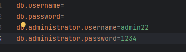

UNIVERSITY PROGRAM
------------------
- This program combines both the original exam and the continuation exam from the class OOP, second semester at Kristiania College University.

INSTALLATION:
------------
1. install connector J
2. Add your MySQL root username and password to the config.properties file 
3. run main!

